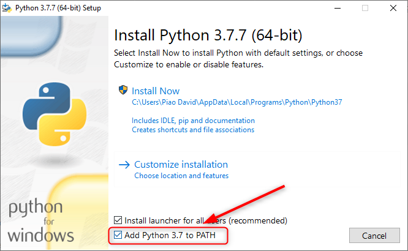
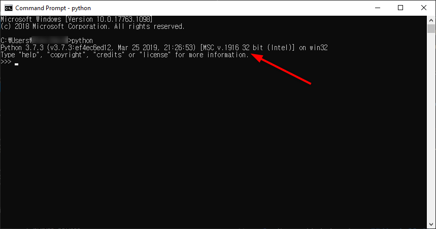

# pyNITA 
 **pyNITA** is the python implementation of Noise Insensitive Trajectory Algorithm (NITA). It can be run from a user-friendly GUI (graphical user interface) or from control scripts. This software is for analysis of satellite imagery time series. One can establish pixel histories at every pixel at every available image date for Landsat imagery (and Sentinel-2 in beta). This can allow for mapping of phenomena such as disturbance (e.g., deforestation, fire), degradation (e.g., drought, charcoal harvest), and recovery.
 
 Please refer to the [Scientific Reports](https://www.nature.com/articles/srep35129) article for detailed description of NITA and its application. The below steps here will walk you through the installation procedure and package requirements necessary for pynita_GUI. 

 Binary releases are available and it is also possible to run from source.
 
 **If you don't know what any of this means, you should follow the "Binary distribution" instructions.**

# Binary distribution (i.e., a simple, double-click executable file)
The binary  of pynita_GUI for Windows and MacOS can be found in [Releases](https://github.com/malonzo47/pynita_GUI/releases).
1. Click on the latest release and then choose the .zip file for your win/mac operating system.
2. Extract that file on your computer and double-click the .exe file to run
3. Demo dataset (point locations, an image stack) can be downloaded from the demo_dataset folder above (3 data files + user_config.ini).

**NOTE**: The binary releases only work after GDAL installataion. If you do not have or have a different version of GDAL, please make sure to follow the below steps to install the appropriate version of GDAL.

# Running from source
First of all, clone this repository using `git clone`.
## 1. Using Docker
Docker is recommended because you can run pynita_GUI in a dedicated container without any conflicts with your system.
If you do not have Docker installed on your machine, please [install Docker first](https://docs.docker.com/install/). 

Unfortunately, at the moment, there is no universal, out-of-the-box Docker way to show GUI. So we need to use different docker run commands for MacOS, Windows, and Linux.
### Windows
1. Clone the repository 
2. Within the pynita_GUI folder, copy all files from **/installation/docker/windows** to the project root folder (the same level with pynita_gui_main.py)
3. Run CMD (Command) as Administrator then run `prerequisites.bat`.
4. While in CMD, run `docker_run_windows.bat`. This will start the pyNITA program.

### MacOS
1. Copy all files from **/installation/docker/macos** to the project root folder.
2. Run `source prerequisites.sh` from terminal.
3. Open Xquartz by running `open -a xquartz` from terminal and make sure the "Allow connections from network clients" is checked "on". You can find this option in **preferences** menu.

4. Run `source docker_run_mac.sh` from terminal.

### Linux
1. Copy all files from **/installation/docker/linux** to the project root folder.
2. Run `bash docker_run_linux.sh` from terminal.

**NOTE**: For this project, a dedicated docker image (pyqtgdal) was built and available at [DockerHub](https://hub.docker.com/repository/docker/freelancedev217/pyqtgdal).

## 2. Using PIP Without Docker
First of all, make sure you have Python 3.7.x installed.
You can download Python installer from the [official website](https://www.python.org/downloads/).
To ensure processing big input data, you need to install 64-bit Python. Also, add Python to the system PATH on installation as follows.

### Windows
1. Go to subdirectory **/installation/source/windows**.
2. Run **as an administrator**  `install_win32.bat` or `install_win64.bat` depending on your Python architecture.
You can check your Python architecture as follows.

3. Go back to the root directory that contains `pynita_gui_main.py` and run `python pynita_gui_main.py`.

### Mac
1. Go to subdirectory **/installation/source/macos**.
2. Run `source install_mac.sh`.
3. Go back to the root directory and run `python pynita_gui_main.py`.
